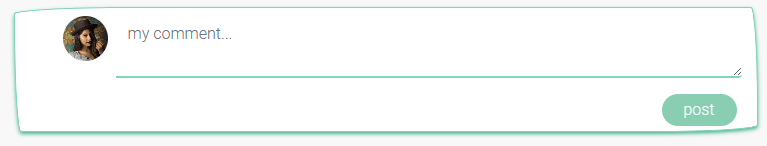

# Kayak Klub
Kayak Klub is a social media platform for anyone who loves kayaking and wants to share information about launchsites, their exact postion (within 3 meters) using the website 'What3words' and leaving any comment about the launchsite that may be of interest to the users. There is also a page where users can add kayaks and equipment for sale.
This fictional site was created for Portfolio Project #5 (Advanced Front End) - Diploma in Full Stack Software Development Diploma at the [Code Institute](https://www.codeinstitute.net).
<br>
## Table of Contents

- [Backend API & Frontend Combined](<#backend-api-frontend-combined>)
- [The Strategy Plane](<#the-strategy-plane>)
    * [Site Goals](<#site-goals>)
    * [What3words](<#what3words>)
    * [Agile Planning](<#agileplanning>)
  
- [Epics](<#epics>)
    * [Set Up](<#set-iup>)
    * [Add A Launchsite](<#add-a-launchsite>)
    * [Comments](<#comments>)
    * [Add A Sale](<#add-a-sale>)
    * [Profiles](<#profiles>)
    * [Contact](<#contact>)
    

- [User Stories](<#user-stories>)
    * [Set Up Backend](<#set-up-backend>)
    * [Set Up Frontend](<#set-up-frontend>)
    * [Add A Launchsite Backend](<#add-a-launchsite-backend>)
    * [Add A Launchsite Frontend](<#add-a-launchsite-frontend>)
    * [Comments Frontend](<#comments-frontend>)
    * [Sales backend](<#sales-backend>)
    * [Sales frontend](<#sales-frontend>)
    * [Profiles backend](<#profiles-backend>)
    * [Profiles frontend](<#profiles-frontend>)
    * [Contact backend](<#contact-backend>)
    * [Contact frontend](<#contact-frontend>)

-[Database Design](<#database-design>)
    * [Entity Relationship Diagram](<#entity-relationship-diagram>)
    * [Security](<#security>)
    * [Python Packages](<#python-packages>)

- [The Structure Plane](<#the-structure-plane>)
    * [Set Up](<#set-up>)
    * [Navigation](<#navigation>)
    * [Home](<#home>)
    * [Comment](<#launch-sites>)
    * [Sales](<#sales>)
    * [Profiles](<#launch-sites>)
    * [Contact](<#launch-sites>)

- [Reusable React Components](#reusable-react-components)

- [The Skeleton Plane](<#the-skeleton-plane>)
    * [Wireframes](<#wireframes>)

- [The Surface Plane](<#the-surface-plane>)   
    * [User Stories](<#user-stories>)
    * [Site Structure](<#site-structure>)
    * [Design Choices](<#design-choices>)

- [Deployment](<#deployment>)   
- [Credits](<#credits>)  
- [Acknowledgement](<#Acknowledgement>)  


<br>


[View live website here](https://kayak-app-03626ad4f3b8.herokuapp.com/)

# Backend API & Frontend Combined
A joint project combining the Django Rest Framework workspace and the React Frontend was created. There were four main benefits to combining this:
* CORS will no longer be an issue as requests and responses will come from a shared base URL, both in my development and production environments.
* I was able to see the terminal logs for my API while interacting with the React side of my project in development, making debugging significantly easier.
* I was able to work on the development versions of both the API and the React project simultaneously.
* With the front and back end applications on the same domain, Cookies (containing the JSONWebToken) required for authentication were not blocked from being set on browsers that currently have cross-site tracking protection enabled by default. This change will allow authentication and authorisation to run in these browsers without errors.

## The Strategy Plane
### Site Goals
Kayak Klub is aimed at all kayak enthusiasts. The site aims to connect users with kayaks (or canoes) to allow them to share launch sites and any other valuable information that may be associated with the launch site such as parking, nearby facilites, ease of use etc. It also allows users to post items for sale such as used kayaks and associated equipment.
<hr>

## What3words
What3words is a digital geocoding system that converts GPS coordinates into 3 word addresses. It lets you identify any location in the world that's three by three meters in size. The system is available for free and it also has Android and iOS apps. It differs from most other location encoding systems in that it displays three words rather than strings of numbers or letters. It is widely used by all emergency services. Please see the website for more details. I have used this within my project as launch sites are not always obvious and can sometimes be a low bank on a river or a specific part of a lake. This helps the users identify exactly where they can launch from.

[What3words Website](https://what3words.com/) 

### Agile Planning
The Agile Methodology was used to plan this project. This was implemented through Github and the Project Board.
Through the use of the Kanban board in the projects view in Github, the project was divided into a few different sections:
Click [here](https://github.com/users/jax-parker/projects/10/views/1) to take you to my board (opens in a new tab)


### Epics

**Set Up**

This Epic covers all the initial setup of the the Django application and Django REST Framework & React application and dependencies in order to begin coding features.

**Add A Launchsite**

This epic covers all API endpoint creation and database connections relating to the CRUD functionality of user posts. This includes like activity. The front end creation of the application in regards to launchsite entries. This is to allow users to interact with the backend API via the user interface in order to create, read, update and delete their own launchsite entries.

**Comments**

This epic covers all API endpoint creation and database connections relating to the CRUD functionality of user comments in relation to posts & the front end creation of the application in regards to comments on posts. This is to allow users to interact with the backend API in order add comments on posts.

**Add A Sale**

This epic covers all API endpoint creation and database connections relating to the CRUD functionality of user posts for the sales section. The front end creation of the application in regards to sales entries. This is to allow users to interact with the backend API via the user interface in order to create, read, update and delete their own sale entries.

**Profiles**

This epic covers all API endpoint creation and database connections relating to the CRUD functionality of user created profiles. This includes following functionality & the front end creation of the application in regards to user profiles. This is to allow users to interact with the backend API via the user interface to manage their own profiles.

**Contact**
This epic covers the front end creation of the application in regards to a contact page. This allows users to interact withthe backend API via the user interface and allow users to contact the site's admin.

## User Stories
By Epic

**Set UP - Backend**
* As a developer, I need to create the base project set up so that I can build out the features.
* As a developer, I need to create a Cloudinary account and create the connection to the project so that static images can be uploaded by users.
* As a developer, I need to create an ElephantSQL acccount to handle my remote database.

**Set Up - Frontend**
* As a user, I would like a favicon on the website so that I can easily know which tab belongs to Kayak Klub
* As a user, I would like a fully responsive navigation menu so that I can easily access the site from any device
* As a logged out user I can see sign in and sign up options so that I can sign in / sign up

**Add A Launchsite - Backend**
* As a user, I want to be able to view edit or delete a launch site
* As a user, I want to able to create a launch site and list launch sites

**Add A Launchsite - Frontend**
* As a logged in user I can create launchsites so that I can share my images and launch site information
* As a user I can keep scrolling through the images on the site, that are loaded for me automatically so that I don't have to click on "next page"
* As a launch site owner I can edit my launch site title and description so that I can make corrections or update my post after it was created
* As a logged in user I can view content filtered by users I follow so that I can keep up to date with what they are posting about
* As a logged in user I can view the launch sites I liked so that I can find the sites I enjoy the most
* As a user I can view all the most recent launch sites, ordered by most recently created first so that I am up to date with the newest content
* As a logged in user I can like a launch site so that I can show my support for the sites that interest me
* As a user, I can search for launch sites with keywords, so that I can find the sites and user profiles I am most interested in
* As a user I can view the details of a single post so that I can learn more about it

**Comments - Frontend**
* As a logged in user I can add comments to a launch site so that I can share my thoughts about the site
* As a user I can see how many comments a launch site has and long ago a comment was made so that I know how old a comment is
* As a user I can read comments on launch sites so that I can read what other users think about the sites
* As an owner of a comment I can delete my comment so that I can control removal of my comment from the application
* As an owner of a comment I can edit my comment so that I can fix or update my existing comment

**Add A Sale - Backend**
* As a user, I want to be able to view edit or delete sales
* As a user, I want to able to create a sale and list sales

**Add A Sale - Frontend**
* As a logged in user I can create a sale so that I can share my images and sale information
* As a user I can keep scrolling through the images on the site, that are loaded for me automatically so that I don't have to click on "next page"
* As a sale owner I can edit my sale title and descriptions, price etc so that I can make corrections or update my post after it was created
* As a user I can view all the most recent sales, ordered by most recently created first so that I am up to date with the newest content
* As a user, I can search for sales with keywords, so that I can find the sales and user profiles I am most interested in
* As a user I can view the details of a single sale so that I can learn more about it
* As a user I can click the buy now button and get a message informing of my purchase.

**Profiles - Backend**
* As a developer, I want to create a new blank profile with default image when a user is created.
* As a user, I want to able to get a list of profiles

**Profiles - Frontend**
* As a user I can view all the launch sites by a specific user so that I can catch up on their latest sites, or decide I want to follow them
* As a user I can view other users profiles so that I can see their launch sites and learn more about them
* As a user I can create a new account so that I can access all the features for signed up users
* As a user I can view user's avatars so that I can easily identify users of the application
* As a user I can tell if I am logged in or not so that I can log in if I need to
* As a user I can see a list of the most followed profiles so that I can see which profiles are popular
* As a user I can view statistics about a specific user: bio, number of posts, follows and users followed so that I can learn more about them
* As a logged in user I can follow and unfollow other users so that I can see and remove launch sites by specific users in my feed
* As a logged in user I can edit my profile so that I can change my profile picture and bio

**Contact - Backend**
* As a developer, I want to create a contact model and API view so that users can contact the site owner with issues

**Contact - Frontend**
* As a user, I would like to be able to contact the site owner (admin) in case I have any issues or queries
<hr>
<br>

## Database Design


## Security
A permissions class was added called IsOwnerOrReadOnly to ensure only users who create the content are able to edit or delete it.

## Python Packages
<details open>
<summary> Details of packages </summary>

* dj-database-url==1.0.0
    * Used to parse the DATABASE_URL connection settings
* dj-rest-auth==2.2.5
    * Used with auth system
* Django==4.1.1
    * Main framework used to start the project
* django-allauth==0.50.0
    * Used for authentication
* django-cors-headers==3.13.0
    * Used for Cross-Origin Resource Sharing (CORS) headers to responses
* django-filter==22.1
    * Used to filter API results in serializers
* django-storages==1.13.1
    * Used to help connect with the google cloud storage bucket
* djangorestframework==3.13.1
    * Framework used to build the API endpoints
* djangorestframework-simplejwt==5.2.0
    * Used with djange rest framework to create access tokens for authentication
* gunicorn==20.1.0
    * Used for deployment of WSGI applications
* Pillow==9.2.0
    * Imaging Libray - used for image uploading
* psycopg2==2.9.3
    * PostgreSQL database adapter to allow deployed application to perform crud on the postgresql db
* PyJWT==2.5.0
    * For creating the Python Json Web Tokens for authentication

Installed as package dependcies:
asgiref==3.7.2
black==23.10.1
click==8.1.7
cloudinary==1.36.0
dj-database-url==0.5.0
dj-rest-auth==2.1.9
Django==3.2.22
django-allauth==0.44.0
django-cloudinary-storage==0.3.0
django-cors-headers==4.3.0
django-filter==23.3
django-resized==1.0.2
djangorestframework==3.14.0
djangorestframework-simplejwt==4.7.2
gunicorn==21.2.0
oauthlib==3.2.2
pathspec==0.11.2
Pillow==8.2.0
psycopg2==2.9.9
psycopg2-binary==2.9.9
PyJWT==2.8.0
python3-openid==3.2.0
pytz==2023.3.post1
requests-oauthlib==1.3.1
sqlparse==0.4.4
whitenoise==6.4.0
</details>
<hr>
<br>

## The Structure Plane
## Features

**Set Up**

`As a developer, I need to create the base project set up so that I can build out the features.`

Implementation:<br>
The base project was created and a virtual environment created with all neccessary packages installed and frozen into the requirements.
The settings were also edited to hide any secret variables and set dev and production environments apart.

`As a developer, I need to create a Cloudinary account and create the connection to the project so that static images can be uploaded by users.`

Implementation:<br>
A Cloudinary account was created to allow image uploads via the service account.

`As a developer, I need to create an ElephantSQL acccount to handle my remote database.`
Implementation:<br>
An ElephantSQL account was created to handle remote database. Ensured that a version >12 was created to enable it to work.

`As a user I can create a new account so that I can access all the features for signed up users`
Django rest framework and dj_rest_auth were installed and added to the url patterns and site packages to make use of their built in authentication system.

`As a developer, I want to create api views for launch sites so that they are available to the front end`
Implementation:

` As a user, I would like a favicon on the website so that I can easily know which tab belongs to Kayak Klub`

Implementation:<br>
A site favicon was implemented with the site's logo. This will allow users to easily identify Kayak Klub when they have multiple tabs open.


`As a logged out user I can see sign in and sign up options so that I can sign in / sign up`

Implementation:<br>
Checks were implemented to detect when a user is signed in or signed out and nav items displayed accordingly. This will prevent users from being able to click buttons from the UI in order to reach restricted pages.

Redirects on the URLS was also implemented to ensure users cannot access pages when logged out if they are for logged in users only.


`As a user, I would like a fully responsive navigation menu so that I can easily access the site from any device`

Implementation:<br>
A navigation menu was implemented than collapses into a hamburger menu on smaller devices.
This will ensure that no navigation items overlap and users can access and navigate the site from any size device.

**Navigation**

` As a logged out user I can see sign in and sign up options so that I can sign in / sign up`

`As a user, I would like a fully responsive navigation menu so that I can easily access the site from any device`

Implementation:<br>
A fully responsive navigation menu has been implemented across the website.

This will allow the users to navigate to different pages on the website with ease from any device. Nav items are different depending on the users logged in state to prevent them accessing areas of the application intended for signed in users.

Logged in users:

When a user is logged in the following navigation items are shown:
`Add launchsite, Home, Feed,Liked, Sign Out, Contact Us, Profile icon and name`


Logged out users:

* Home, Sign In, Sign Up


The site logo is displayed on the left side of the navigation at all times.

The navigation icons change to a white colour when the page is active. This is to indicate to users which page they are currently on.

**Home**

`As a user I can view all the most recent launch sites, ordered by most recently created first so that I am up to date with the newest content`

Implementation:<br>
The home page displays user launchsite posts in order of newest sites first. This will prevent users from being shown content they have already seen at the top and reduce the need for them to 'search' for new content. These launchsite posts are visible to all users regardless of logged in status. This will allow non registered users to get a feel for the content on the site to know whether they are interested in signing up. 

Restricted access has been implemented on the launchsite posts for users who are not signed in, they will not be able to create a launchsite, like or comment.

**Launch Sites**

`As a logged in user I can create launch sites so that I can share my images and launch site information`

Implementation:<br>
A 'Add launchsite' button has been implemented in the nav bar in order for logged in users to create a post when they want to share something. This takes you to the launch site posts page where users can upload an image, name the launchsite, add a location, add a what3words and leave a comment. A cancel button will take you back to the home page and the create button will post your launchsite to the top of the home page.


`As a user I can keep scrolling through the images on the site, that are loaded for me automatically so that I don't have to click on "next page"`

Implementation:<br>
Infinite scrolling was implemented to load 10 posts at a time and when user reaches the end of the scroll, it will load 10 more and so on. This will allow for optimal load times to enhance viewing pleasure.

`As a launch site owner I can edit my launch site title and description so that I can make corrections or update my post after it was created`

Implementation:<br>
Only the user who created the post will be able to edit or delete that post. This will ensure that users have full control of their own posts and unauthorized users cannot tamper with them.

`As a logged in user I can view content filtered by users I follow so that I can keep up to date with what they are posting about`

Implementation:<br>
Users can also click the Feed navigation item and this will display only posts from users the person has followed.

`As a logged in user I can like a launch site so that I can show my support for the sites that interest me`

Implementation:<br>
Logged in users have full access to post, comment, like or unlike. This will help ensure that unregistered users do not spam the website while also ensuring genuine users register to the site.


`As a user, I can search for launch sites with keywords, so that I can find the sites and user profiles I am most interested in`

Implementation:<br>
A search bar has been added that will allow users to search for keywords so that they can search for content that interests them.


`As a user I can view the details of a single post so that I can learn more about it`
Implementation:<br>
A logged on user can click on a post to view it individually and see what comments other users have left and leave their own comment.

**Comments**

`As a logged in user I can add comments to a launch site so that I can share my thoughts about the site`
Implementation:<br>
Below each post, there will be a comment box available to logged in users. This will allow users to add comments under posts.

`As a user I can see how many comments a launch site has and long ago a comment was made so that I know how old a comment is`
Implementation:<br>
A comment count will also be shown under the post, to allow users to see how many people have commented on each post.
A comment or updated time will be displayed in either minutes ago or days ago

`As a user I can read comments on launch sites so that I can read what other users think about the sites`
Implementation:<br>
The username and Avatar of the user that created the comment will displayed on each comment

`As an owner of a comment I can delete my comment so that I can control removal of my comment from the application`
Implementation:<br>
A delete button has been implemented to allow the user to edit or delete their comment.

`As an owner of a comment I can edit my comment so that I can fix or update my existing comment`
Implementation:<br>
An edit button has been implemented to allow the user to edit or delete their comment.



**Sales**
`As a logged in user I can create a sale so that I can share my images and sale information`
Implementation:<br>
A 'Add a Sale' button has been implemented in the nav bar in order for logged in users to create a sale post when they want to share something for sale. This takes you to the sale site sales page where users can upload an image, name the sale, add a descripton, add a condition, add a price and add a location. A cancel button will take you back to the home page and the add sale button will post your launchsite to the top of the home page.


`As a user I can keep scrolling through the images on the site, that are loaded for me automatically so that I don't have to click on "next page"`
Implementation:<br>
Infinite scrolling was implemented to load 10 posts at a time and when user reaches the end of the scroll, it will load 10 more and so on. This will allow for optimal load times to enhance viewing pleasure.

`As a sale owner I can edit my sale title and descriptions, price etc so that I can make corrections or update my post after it was created`
Implementation:<br>
Only the user who created the post will be able to edit or delete that post. This will ensure that users have full control of their own posts and unauthorized users cannot tamper with them.


`As a user I can view all the most recent sales, ordered by most recently created first so that I am up to date with the newest content`
Implementation:<br>
Users can see sales in order of date - newest created first.

`As a user, I can search for sales with keywords, so that I can find the sales and user profiles I am most interested in`
Implementation:<br>
A search bar has been added that will allow users to search for keywords so that they can search for content that interests them.

`As a user I can view the details of a single sale so that I can learn more about it`
Implementation:<br>
A logged on user can click on a post to view it individually.


`As a user I can click the buy now button and get a message informing of my purchase.`
Implementation:<br>
A user can click on the buy now button and receive a message that the seller will contact them. In future improvements to the site - this would be improved by sending a message/email to the seller or a direct payment page. Direct payment is not implemented in this project.


**Profiles**

`As a user I can view other users profiles so that I can see their launch sites and learn more about them`
`As a logged in user I can edit my profile so that I can change my profile picture and bio`
`As a user I can view user's avatars so that I can easily identify users of the application`
`As a user I can tell if I am logged in or not so that I can log in if I need to`


`As a user I can see a list of the most followed profiles so that I can see which profiles are popular`
Implementation:<br>
A component showing the most followed users is shown and the user profiles are able to be viewed by clicking on these. On a desktop, the most followed users has 10 users. On a mobile device this is restricted to 4 so that it does not take up too much room as scrolling may become a nuisance. A follow button will also be displayed that will allow the logged in user to follow the target user.


`As a user I can view statistics about a specific user: bio, number of posts, follows and users followed so that I can learn more about them`
`As a logged in user I can follow and unfollow other users so that I can see and remove launch sites by specific users in my feed`

**Contact**

`As a user, I would like to be able to contact the site owner (admin) in case I have any issues or queries`
Implementation:<br>
A contact form was added to the navigation that will allow users to submit a contact request if they have any issues or queries.


## Reusable Components
Reusable React components are self-contained, modular pieces of UI that can be used and reused across different parts of an application. They promote code reusability, maintainability, and consistency in design. Here are the ones I have used within my project:

* Alert Message: This component is used to display messages to the user. It is used twice in my project in the contact and sale pages.

* Asset: This component is used to display images and videos. It is used to show the spinner when waiting for a page to load.

* Avatar: This component is used to display user profile pictures.

* More Dropdown: This component is used to display a menu of additional options. It is replicated in this project by the three dots image.

* Nav Bar: This component is used to display the main navigation menu and is shown on each page of this project to enable the user to move around the project easily.

* NotFound: This component is used to display a message when a page is not found. A custom 401 graphic was used for this page.
## The Skeleton Plane
### Wireframes
<details>
Home, Add Launchsite, Liked & Feed

Sign Up


<br>

Sign In


<br>

Add Launchsite


Add A Sale


View Launchsites & Most Popular Profiles


<br>

Profiles


<br>

Contact


<br>
</details>

<summary>All Wireframe Images</summary>

## The Surface Plane

## Design

#### Colour-Scheme
I used the colour palette supplied by Looka when I created my logo


#### Typography
I have chosen a font that is clear to read - Roboto


#### Imagery
The images on this website are user uploaded except for the logo which was created at [Looka.com](https://looka.com/)
## Technologies
The website has been implemented with the use of a variety of technologies.

- [HTML](https://en.wikipedia.org/wiki/HTML) used for the main site content.
- [CSS](https://en.wikipedia.org/wiki/CSS) used for the main site design and layout.
- [JSX](https://legacy.reactjs.org/docs/introducing-jsx.html) used for user interaction on the site.
- [Python](https://www.python.org) used as the back-end programming language.
- [Git](https://git-scm.com) used for version control.
- [GitHub](https://github.com) used for secure online code storage.
- [React Bootstrap](https://react-bootstrap.netlify.app/) used as the front-end CSS framework for modern responsiveness and pre-built components.
- [Django](https://www.djangoproject.com) used as the Python framework for the site.
- [PostgreSQL](https://www.postgresql.org) used as the relational database management.
- [ElephantSQL](https://www.elephantsql.com) used as the Postgres database.
- [Looka](Looka.com) used to create the Bookends Logo
- [Cloudinary](https://cloudinary.com) used to host Static files for the site
- [Heroku](https://www.heroku.com) used for hosting the deployed back-end site.

## Testing & Bugs
Testing can be found in the [TESTING.md file](https://github.com/jax-parker/kayak-app/blob/main/TESTING.md)
<hr>
<br>

## Deployment
## Heroku Deployment - Combined project Set Up
* Because the React part of the project contains static files, I needed to store all the static files for deployment, using WhiteNoise. WhiteNoise will also store the static files for the Django Admin panel.
* The React front end will be served from the domain’s root URL, so I needed to ensure that this is the React part of the project and not the DRF interface I worked with when the projects were separate. So I added code to ensure that the home page will display the React application. Any 404 errors redirect the user back to the React application where the request will be handled by the react-router-dom. I also adjusted my URLs so that all URLs for the DRF API contain /api/ to ensure that the API’s routes do not clash with the React application’s routes.
* Next I had to compile all the static files from both the django admin panel and the React files into the staticfiles folder for deployment. This had to be done each time any changes were made to the front end using the following code.
    * mkdir staticfiles
    * python3 manage.py collectstatic
    * cd frontend
    * npm run build && mv build ../staticfiles/.
    Any time I wanted redeploy I would run:
    * npm run build && rm -rf ../staticfiles/build && mv build ../staticfiles/.
    * I then added a runtime.txt file and added python-3.9.16 to ensure Heroku uses the correct version of Python to deploy my project

### 1. Creating the Django Project
* If development if being done locally: Activate your virtual environment
* To ensure the virtual environment is not tracked by version control, add .venv to the .gitignore file.
* Install Django and gunicorn: `pip3 install django gunicorn`
* Install supporting database libraries dj_database_url and psycopg2 library: `pip install dj_database_url psycopg2`
* Install Cloudinary libraries to manage static files: `pip install dj-3-cloudinary-storage`
* Create file for requirements: `pip freeze --local > requirements.txt`
* Create project:`django-admin startproject project_name .`
* Create app: `python manage.py startapp app_name`
* Add app to list of `installed apps` in settings.py file: `'app_name'`
* Migrate changes: `python manage.py migrate`
* Test server works locally: `python manage.py runserver`

### 2. Create your Heroku app
* Navigate to the Heroku website
* Create a Heroku account by entering your email address and a password (or login if you have one already).
* Activate the account through the authentication email sent to your email account
* Click the **new button** on the top right corner of the screen and select create a new app from the dropdown menu.
* Enter a unique name for the application.
* Select the appropriate region for the application.
* Click create app
* In the Heroku dashboard click on the Resources tab
* Scroll down to Add-Ons, search for and select 'Heroku Postgres'
* In the Settings tab, scroll down to 'Reveal Config Vars' and copy the text in the box beside DATABASE_URL.

### 3. Set up Environment Variables
* In you IDE create a new env.py file in the top level directory
* Add env.py to the .gitignore file
* In env.py import the os library
* In env.py add `os.environ["DATABASE_URL"]` = "Paste in the text link copied above from Heroku DATABASE_URL"
* In env.py add `os.environ["SECRET_KEY"] = "Make up your own random secret key"
* In env.py add `os.environ["CLOUDINARY]` = "Paste in the API Environment Variable link from Cloudinary and remove the prefix"
* In Heroku Settings tab Config Vars enter the same secret key created in env.py by entering 'SECRET_KEY' in the box for 'KEY' and your randomly created secret key in the 'value' box.

### 4. Setting up settings.py

* In your Django 'settings.py' file type:

 ```
 from pathlib import Path
 import os
 import dj_database_url

 if os.path.isfile("env.py"):
  import env
 ```
* Remove the default insecure secret key in settings.py and replace with the link to the secret key variable in Heroku by typing: `SECRET_KEY = os.environ.get(SECRET_KEY)`
* Comment out the `DATABASES` section in settings.py and replace with:
```
DATABASES = {
  'default': 
  dj_database_url.parse(os.environ.get("DATABASE_URL"))
  }`
```
* Create a Cloudinary account and from the 'Dashboard' in Cloudinary copy your url into the env.py file by typing: `os.environ["CLOUDINARY_URL"] = "cloudinary://<insert-your-url>"`
* In Heroku  add cloudinary url to 'config vars'
* In Heroku config vars add DISABLE_COLLECTSTATIC with value of '1' (note: this must be removed for final deployment)
* Add Cloudinary libraries to the installed apps section of settings.py file:
 ```
 'cloudinary_storage'
 'django.contrib.staticfiles''
 'cloudinary'
 ```
* Connect Cloudinary to the Django app in `settings.py`:

* Make an initial commit and push the code to the GitHub Repository.
    ```git add .```
    ```git commit -m "Initial deployment"```
    ```git push```

### 5. Heroku Deployment: 
* Click Deploy tab in Heroku
* In the 'Deployment method' section select 'Github' and click the 'connect to Github' button to confirm.
* In the 'search' box enter the Github repository name for the project
* Click search and then click connect to link the heroku app with the Github repository. The box will confirm that heroku is connected to the repository.

### 6. Final Deployment
In the IDE: 
* When development is complete change the debug setting to: `DEBUG = False` in `env.py` 
* In Heroku settings config vars change the DISABLE_COLLECTSTATIC value to 0
* Because DEBUG must be switched to True for development and False for production it is recommended that only manual deployment is used in Heroku. 
* To manually deploy click the button 'Deploy Branch'. The default 'main' option in the dropdown menu should be selected in both cases. When the app is deployed a message 'Your app was successfully deployed' will be shown. Click 'view' to see the deployed app in the browser.

## To fork the repository on GitHub

A copy of the GitHub Repository can be made by forking the GitHub account. Changes can be made on this copy without affecting the original repository.

1. Log in to GitHub and locate the repository in question.
2. Locate the Fork button which can be found in the top corner, right-hand side of the page, inline with the repository name.
3. Click this button to create a copy of the original repository in your GitHub Account.

## To clone the repository on GitHub

1. Click on the code button which is underneath the main tab and repository name to the right.
2. In the 'Clone with HTTPS' section, click on the clipboard icon to copy the URL.
3. Open Git Bash in your IDE of choice.
4. Change the current working directory to where you want the cloned directory to be made.
5. Type git clone, and then paste the URL copied from GitHub.
6. Press enter and the clone of your repository will be created.


# Credits
* The logo was created at [Looka](Looka.com)
* The No Results found image s taken from [VectorStock](VectorStock.com)
* This helped me create the Alert modal [React Alerts](https://react-bootstrap.github.io/docs/components/alerts/)
<hr>
<br>

### Acknowledgements
I'd like to thank Alan, Sean, Oisin and Sarah in Student Services for all their help, hints and advice.
Thank you to my Slack buddy Ayla for keeping my spirits up when I struggled along the way.
Thank you to my family for putting up with missing holiday breaks as I used them to get this course completed.